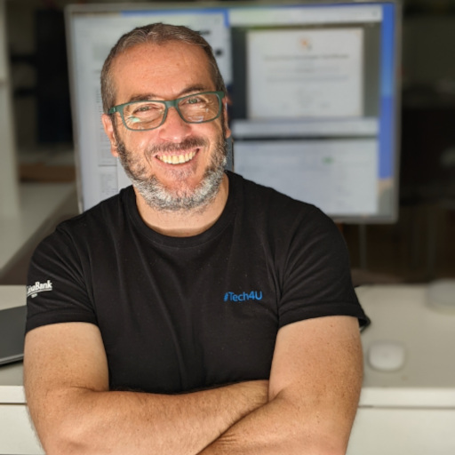

  
  
  <h1>Pere Martra</h1>
  
  

    AI Engineer & Researcher. Author of "Large Language Models Projects" (Apress) & "Rearchitecting LLMs" (Manning). Expert in Pruning, Efficiency & Fairness.
  

  

    I offer limited consulting slots for teams needing guidance on LLM Efficiency, RAG Architectures, or Model Pruning.
  

  

    <a href="https://github.com/peremartra">GitHub</a> | 
    <a href="https://medium.com/@peremartra">Medium</a>
  

